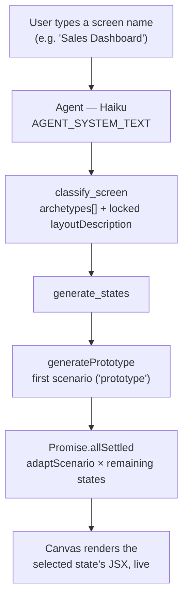
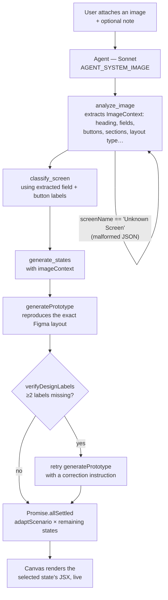

# State Engine

Start from a screen name, or a screenshot of one. State Engine classifies it into a
UI behaviour archetype and derives **every non-happy-path state** (loading, error,
empty, …) as live, interactive [Razorpay Blade](https://blade.razorpay.com)
prototypes — with the layout locked identical across states, so only the
component _state_ changes.

## Tech Stack

- **Framework:** Next.js 16 (App Router, Turbopack)
- **UI:** React 19, `@razorpay/blade` + styled-components, Tailwind CSS v4 (layout shell only)
- **Language:** TypeScript 5
- **AI:** [Vercel AI SDK](https://ai-sdk.dev) (`ai`, `@ai-sdk/anthropic`, `@ai-sdk/react`) driving Claude Haiku + Sonnet, streamed via `useChat`
- **In-browser render:** `@babel/standalone` (classic JSX runtime) → `new Function` eval with Blade injected
- **Auth:** Clerk
- **Persistence:** SingleStore (MySQL-compatible) for sessions + usage; chat history streamed over SSE
- **Testing:** Vitest

## How it works

The whole app is one chat surface (`useChat` → `POST /api/chat`). Every message
either **starts a new screen** or **modifies the current one**, and the agent
picks its toolset based on whether the message includes an image:

```
Chat message
    │
    ├─ text only ─────────────► Haiku · AGENT_SYSTEM_TEXT
    │                                  classify_screen → generate_states
    │
    └─ image (+ optional text) ─► Sonnet · AGENT_SYSTEM_IMAGE
                                       analyze_image → classify_screen → generate_states
                                                                │
                                                                ▼
                              generatePrototype (1st scenario) → Promise.allSettled(adaptScenario × rest)
                                                                │
                                                                ▼
                        Canvas: compileJsx (Babel, classic runtime) → evalComponent (Blade in scope)
```

- **`generate_states`** always produces the first scenario (`prototype`) directly,
  then fans the remaining scenarios out in parallel with `adaptScenario`, so one
  slow/failed state never blocks the others.
- **Canvas** transpiles the generated JSX in the browser and evaluates it with
  Blade components + React hooks injected into scope (no `import` statements in
  generated code — see `src/lib/renderer.ts`).
- **Sessions** persist server-side (SingleStore) per signed-in user, so history
  survives across devices; each generation streams in as `data-state` parts.

### Flow A — Prompt only

Just a screen name (or a follow-up instruction like "make it a two-column layout").



**Example**

```
You: Sales Dashboard
```

→ classified as a dashboard archetype → states `prototype`, `loading`, `empty`,
`error` streamed in and rendered one by one, all sharing the same locked layout.

```
You: make the primary button teal          (follow-up, same session)
```

→ `generate_states` is called again with the existing scenarios + an
`instruction`; `classify_screen` is skipped since the layout is already known.

### Flow B — Image + prompt (optional)

Attach a screenshot (PNG/JPEG/WebP, ≤5 MB) of a Figma frame or existing UI, with
an optional note for anything the image doesn't convey.



**Example**

```
You: [attaches login-frame.png] "swap the CTA copy to 'Sign in'"
```

→ `analyze_image` reads the frame and extracts a structured `ImageContext`
(heading, input fields with types, buttons, layout shape, colour mood, …) →
`classify_screen` uses the extracted field/button labels as components →
`generate_states` passes `imageContext` through so the prototype reproduces the
real layout, then self-corrects if `verifyDesignLabels` finds missing elements.

The note is optional — dropping just the image is enough to kick off the same
flow.

## Setup

### Prerequisites

- Node.js 18+
- An Anthropic API key (optional — see [modes](#two-modes) below)

### 1. Install dependencies

```bash
npm install --legacy-peer-deps      # Blade's peer range predates React 19
```

### 2. Environment setup

| Variable                              | Required | Description                                    |
| -------------------------------------- | -------- | ----------------------------------------------- |
| `ANTHROPIC_API_KEY`                    | optional | Enables live Claude generation (see below)      |
| `NEXT_PUBLIC_CLERK_PUBLISHABLE_KEY`    | yes      | Clerk auth (client)                             |
| `CLERK_SECRET_KEY`                     | yes      | Clerk auth (server)                             |
| `SINGLESTORE_HOST`                     | yes      | Session + usage persistence                     |
| `SINGLESTORE_PORT`                     | yes      | Session + usage persistence                     |
| `SINGLESTORE_USER`                     | yes      | Session + usage persistence                     |
| `SINGLESTORE_PASSWORD`                 | yes      | Session + usage persistence                     |
| `SINGLESTORE_DATABASE`                 | yes      | Session + usage persistence                     |

### 3. Development

```bash
npm run dev                         # http://localhost:3000
```

Try `Sales Dashboard` or `Login Page` and press Enter, or attach a screenshot.

### Two modes

**Artifacts mode (default).** Without `ANTHROPIC_API_KEY`, generation falls
back to pre-generated outputs bundled in `src/lib/artifacts/` (Sales
Dashboard, Login Page) — no API cost, deterministic, ideal for a shareable
demo. The UX is identical: input → classify → parallel generate →
state-switching with a locked layout.

**Live AI mode.** Set `ANTHROPIC_API_KEY` to run genuine Claude generation for
any screen name or image. The agent tool-call flow is the same either way —
only the underlying model calls change.

## Scripts

| Command             | Purpose                 |
| -------------------- | ------------------------ |
| `npm run dev`        | Dev server (Turbopack)   |
| `npm run build`      | Production build         |
| `npm start`          | Run production server    |
| `npm test`           | Vitest unit tests        |
| `npm run test:watch` | Vitest in watch mode     |
| `npm run lint`       | ESLint                   |

## Deploy (Vercel)

1. Push to GitHub.
2. Import the repo in Vercel.
3. Add the environment variables from [above](#2-environment-setup) in
   Project → Settings → Environment Variables.
4. Deploy.
